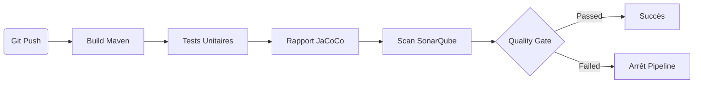

# Projet d’Intégration Continue : Refactoring & Pipeline DevOps

École : ENSA Marrakech
Module : Ingénierie Logicielle
Filière : Génie Informatique

## 1. Description du projet

Ce projet consiste à transformer une application de vote monolithique en une solution modulaire, maintenable et testable. L’objectif principal était de séparer la logique métier de la persistance et de l’interface utilisateur, tout en mettant en place une chaîne CI/CD complète et professionnelle.

## 2. Architecture et Design Patterns

### Architecture globale (Diagramme de classes)


### Justification des choix techniques

#### Pattern Factory Method (RepositoryFactory)

* **But** : Abstraire la création de la couche de persistance.
* **Gain** : Possibilité de basculer d’un stockage en mémoire à un stockage SQL/NoSQL sans toucher au code client.

#### Pattern Strategy (CountingStrategy)

* **But** : Isoler les algorithmes de comptage des votes.
* **Gain** : Permet de changer le mode de scrutin (majorité simple, proportionnelle, jugement majoritaire…).

#### Pattern Observer (VoteListener)

* **But** : Réagir aux votes sans couplage direct.
* **Gain** : Sépare les fonctionnalités transverses (logs, audit, notifications).

## 3. Historique du refactoring (Git Flow)

| Hash    | Message                         | Description                                                     |
| ------- | ------------------------------- | --------------------------------------------------------------- |
| af04428 | init                            | Import du code legacy et analyse.                               |
| 540aa9b | refactor spaghetti code         | Découpage du monolithe et ajout des patterns Strategy/Observer. |
| f015a4c | add tests                       | Création des premiers tests unitaires.                          |
| ca6f517 | remove spaghettiVotingApp       | Suppression du code legacy après validation.                    |
| 301f5db | add tests to get >=60% coverage | Amélioration de la couverture de test.                          |
| 1804366 | add jenkins/sonarqube docker    | Mise en place de l’environnement CI/CD Docker.                  |
| 07ae03f | add sonarqube                   | Configuration du scanner SonarQube.                             |
| 564f996 | add Jenkinsfile                 | Création du pipeline déclaratif.                                |

## 4. Pipeline CI/CD automatisé

### Workflow Jenkins



## 5. Rapports de qualité

### A. Couverture de code (JaCoCo)

* Ciblage des classes critiques : services et stratégies.
* Objectif : > 60% de couverture.


### B. Analyse statique (SonarQube)

* Résultats conformes.
* Aucun code smell majeur.
* Aucune duplication significative.


### C. Exécution du pipeline (Jenkins)

* Pipeline multibranche fonctionnel.
* Toutes les étapes validées.


## 6. Retour d’expérience

### 1. Problème : Communication entre conteneurs (Connection Refused)

* **Cause** : Jenkins tentait d’appeler SonarQube via `localhost`.
* **Solution** : Utilisation de `http://sonarqube:9000` (nom du service Docker).

### 2. Problème : Blocage du Quality Gate (Webhook)

* **Cause** : Jenkins rejetait les webhooks anonymes.
* **Solution** : Utilisation d’un secret partagé entre SonarQube et Jenkins.

### 3. Problème : Configuration du JDK

* **Cause** : Outil JDK non installé dans Jenkins.
* **Solution** : Utilisation du JDK par défaut du conteneur Jenkins.

## 7. Guide d'utilisation

### A. Configuration Jenkins et SonarQube

#### 1. Lancer les conteneurs

```bash
docker compose up -d
```

Récupérer le mot de passe Jenkins :

```bash
docker logs vote-jenkins-1
```

Accéder à Jenkins : [http://localhost:8080](http://localhost:8080)

#### 2. Installer les plugins nécessaires

* SonarQube Scanner
* JaCoCo
* HTML Publisher

#### 3. Configurer Maven

Manage Jenkins > Tools :

* Add Maven
* Name : `maven`
* Install automatically

#### 4. Configurer le webhook SonarQube → Jenkins

Administration > Webhooks :

* Name : Jenkins
* URL : [http://jenkins:8080/sonarqube-webhook/](http://jenkins:8080/sonarqube-webhook/)
* Secret : HMAC partagé

#### 5. Configurer Jenkins → SonarQube

Manage Jenkins > System :

* Name : `sonar`
* Server URL : [http://sonarqube:9000](http://sonarqube:9000)
* Authentication token : Token SonarQube

#### 6. Créer le pipeline multibranche

* New Item → Multibranch Pipeline
* Branch Sources : Git
* URL : ton dépôt GitHub

---

### B. Builder le projet

```bash
mvn clean package
```

Jar généré dans :

```
target/vote-1.0-SNAPSHOT.jar
```

### C. Lancer les tests

```bash
mvn test
```

Rapport :

```
target/site/jacoco/index.html
```

### D. Exécuter l’application

```bash
java -jar target/vote-1.0-SNAPSHOT.jar
```
